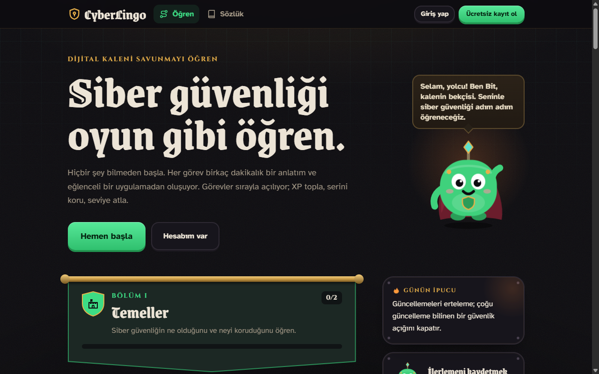
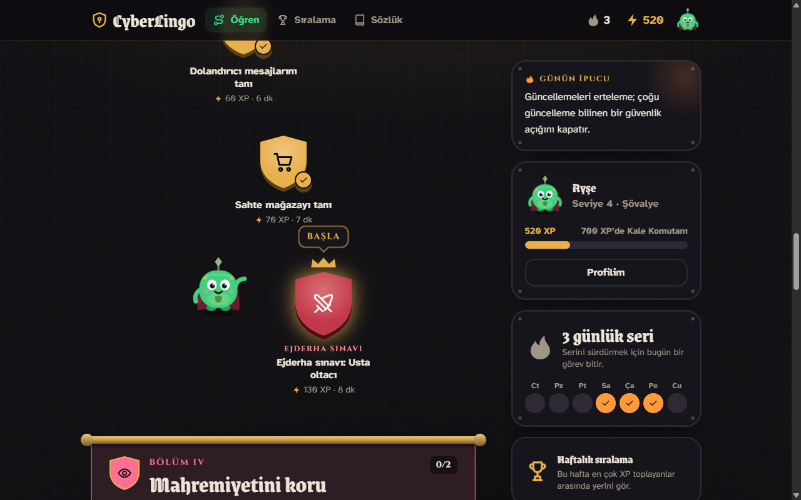
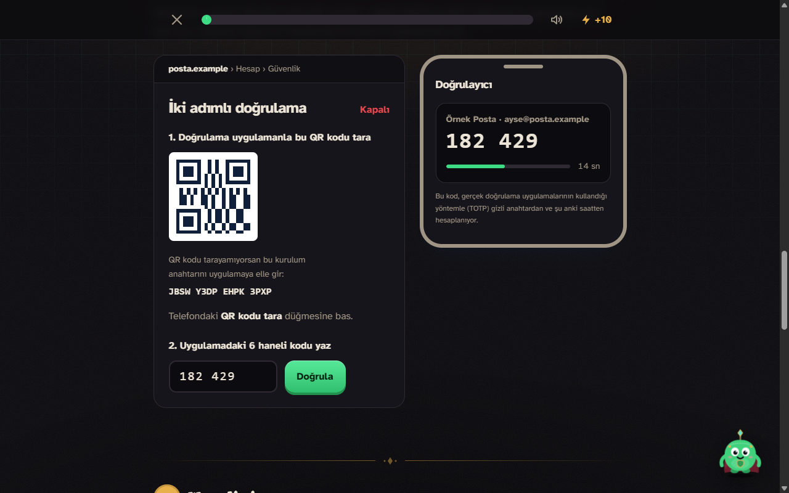
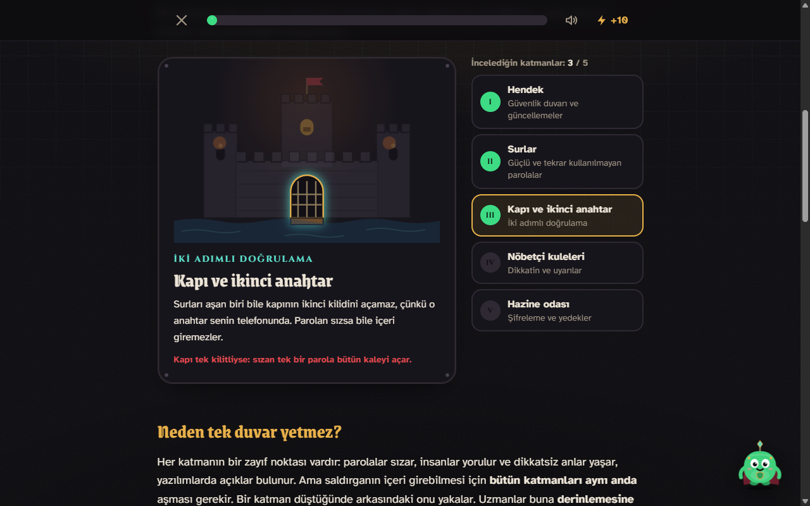
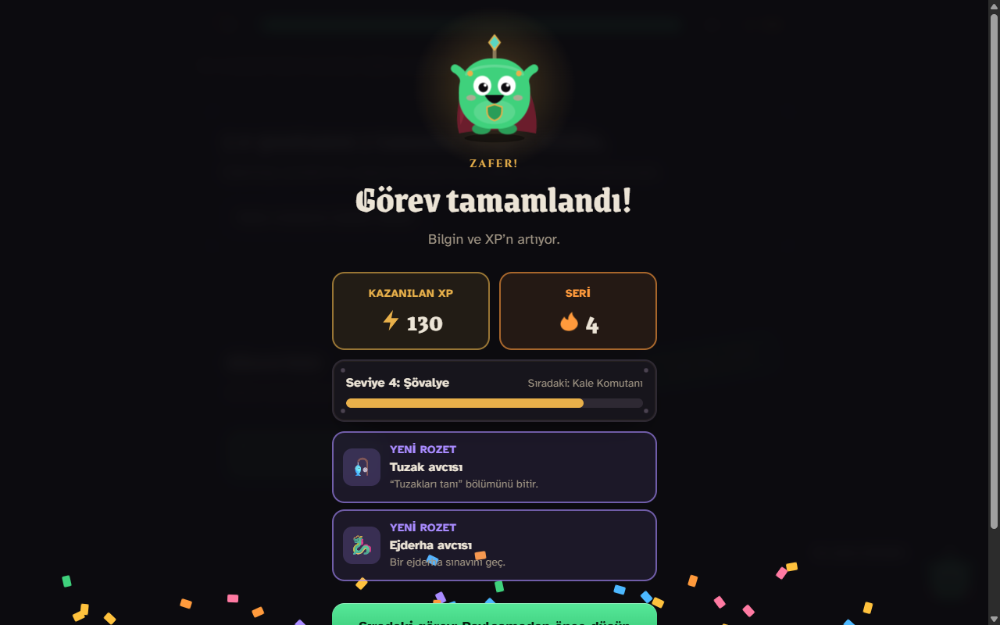
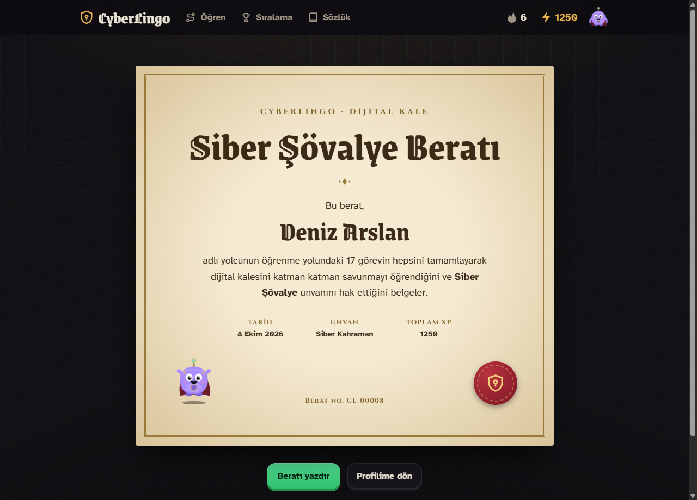
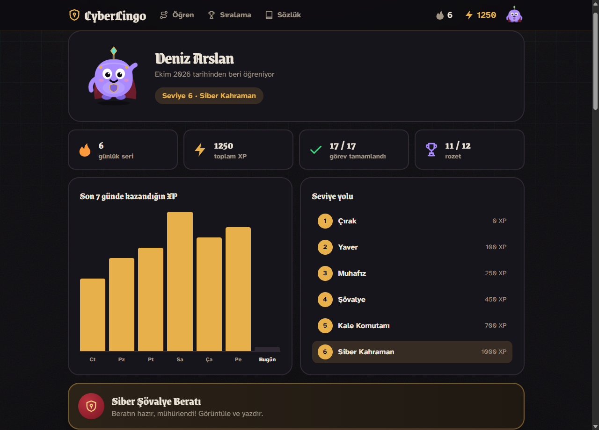
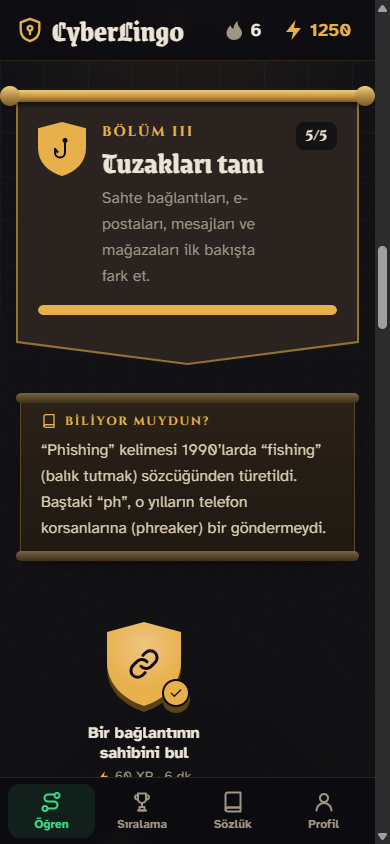

<p align="center">
  
</p>

<h1 align="center">CyberLingo</h1>

<p align="center">
  <strong>Siber güvenliği oyun gibi öğren.</strong><br>
  Hiçbir şey bilmeyenler için Duolingo tarzı, Türkçe ve baştan sona interaktif bir siber güvenlik öğrenme uygulaması.
</p>

<p align="center">
  Laravel 13 · PHP 8.3+ · Tailwind CSS 4 · Vite · SQLite / Postgres · Pest
</p>



## Nedir?

CyberLingo, siber güvenliği ezberletmek yerine **yaptırarak** öğretir. Her görev birkaç dakikalık kısa bir anlatım, gerçek hayattan alınmış
interaktif bir alıştırma ve küçük bir testten oluşur. Görevler bir öğrenme yolu üzerinde sırayla açılır; bitirdikçe XP toplar, günlük serini
korur, seviye atlar ve rozet kazanırsın.

Uygulamanın teması bir Orta Çağ kalesi: hendek, surlar, kapı, nöbetçiler ve hazine odası. Her görev dijital kalene yeni bir savunma
katmanı ekler. Yol boyunca sana kalenin pelerinli küçük bekçisi **Bit** eşlik eder: doğru cevaplarda zıplar, yanlışlarda üzülür,
görev bitince seninle birlikte kutlar.

## Öne çıkanlar

- **26 görev, 8 bölüm.** Normal dersler, kısa “ara bilgi” dersleri ve bölüm sonlarında geçme notu isteyen ejderha sınavları.
- **Gerçekçi alıştırmalar.** Saniyede bir değişen kod üreten bir doğrulama uygulaması, saldırganın ekranından kafe Wi-Fi’ı trafiği,
  sahte bir mağaza sayfasında tehlike işareti avı, Sezar çarkıyla şifre kırma, fidye yazılımı simülasyonu ve daha fazlası.
- **Kriz anında.** Veri sızıntısı raporu okuma, ele geçirilen hesabı geri alma ve kaybolan telefon için adım adım kriz planları;
  aynı anda yapılabilecek adımlar istenen sırada seçilebilir, tuzak adımlar açıklamasıyla elenir.
- **Etik hack.** Beyaz, gri ve siyah şapkayı ayıran çizgi (izin ve yasalar), bir açığı sorumlu bildirme ve kısa kod parçalarında
  açığı bulup doğru düzeltmeyi seçtiren savunmacı bir kod incelemesi. Saldırı tekniği öğretilmez.
- **Savunma hattı.** Bir HTTP isteğinin DNS’ten TLS’e yolculuğu ve gerçek bir istek/yanıtın okunması, tarayıcıda çalışan bir
  SHA-256 ve tuz laboratuvarı, süzülebilen giriş kayıtlarında bir saldırının izlerini bulma.
- **Oyunlaştırma.** XP, günlük seri, Çırak’tan Siber Kahraman’a 6 seviye, 16 rozet, haftalık sıralama ve yolun sonunda yazdırılabilir
  bir **Siber Şövalye Beratı**.
- **Kale kontrol listesi.** Öğrendiklerini gerçek hayatta uyguladıkça işaretlediğin 12 maddelik kişisel güvenlik listesi. Her madde onu
  anlatan göreve bağlı, işaretler hesabına kaydedilir ve listeyi bitirene rozet verilir.
- **Hesaplar.** Kayıt ve giriş, profil, maskot rengini seçme, hesabı silme. İlk görev hesap açmadan denenebilir; misafirken kazanılan
  ilerleme kayıt olunca hesaba aktarılır.
- **Canlı bir arayüz.** Animasyonlu maskot, konfetili kutlama ekranı, ses efektleri, kaydırdıkça beliren bölümler. Cihazında
  “hareketi azalt” ayarı açıksa animasyonlar kapanır.
- **Sözlük.** 78 terimin kısa açıklaması; her terim onu anlatan göreve bağlı ve Türkçe karakter yazmadan da aranabiliyor.
- **Telefona uygun.** Telefonda alt sekme çubuğu, alt alta dizilen düzen ve dokunmaya uygun alıştırmalar.

## Ekran görüntüleri

| | |
|---|---|
|  |  |
| **Öğrenme yolu:** Kalkan biçimindeki görevler sırayla açılır; sıradaki görevde Bit seni bekler. | **İki adımlı doğrulama:** Telefondaki uygulama, gerçek uygulamalarla aynı yöntemle (TOTP) her 30 saniyede yeni bir kod üretir. |
|  |  |
| **Kale savunması:** Kalenin her katmanına tıklayınca siber dünyadaki karşılığı açılır. | **Kutlama:** Görev bitince XP, seri, seviye ve yeni rozetler. |
|  |  |
| **Siber Şövalye Beratı:** Bütün görevleri bitirene verilen, yazdırılabilir berat. | **Profil:** Seri, XP, son 7 günün grafiği, seviye yolu ve rozetler. |

<p align="center">
  
</p>

## Öğrenme yolu

| Bölüm | # | Görev | Tür | Alıştırma |
|---|---|---|---|---|
| **I · Temeller** | 1 | Siber güvenliğe ilk adım | Ders | Olayları gizlilik, bütünlük ve erişilebilirlik kutularına ayır |
| | 2 | Kaleni katman katman savun | Ara bilgi | Kalenin katmanlarını gez, derinlemesine savunmayı keşfet |
| **II · Hesaplarını koru** | 3 | Güçlü bir parola oluştur | Ders | Parola laboratuvarında kırılma süresini canlı izle |
| | 4 | İki adımlı doğrulamayı kur | Ders | Doğrulama uygulaması kur, sonra saldırgan olarak kodu tahmin etmeye çalış |
| | 5 | Parola kasanı kur | Ara bilgi | Kasayı aç, parola üret ve kasanın sahte siteyi tanıdığını gör |
| **III · Tuzakları tanı** | 6 | Bir bağlantının sahibini bul | Ders | Adres çubuğunda alan adını bul, sahte adresleri ayır |
| | 7 | Oltalama e-postasını yakala | Ders | Gelen kutusundaki beş e-postayı güvenli ya da oltalama diye işaretle |
| | 8 | Dolandırıcı mesajlarını tanı | Ders | İki sahte mesajlaşmada doğru yanıtları seç |
| | 9 | Sahte mağazayı tanı | Ders | Mağaza sayfasında yedi tehlike işaretini bul |
| | 10 | Ejderha sınavı: Usta oltacı | Ejderha sınavı | Beş ustaca e-posta; geçmek için en az 4 doğru |
| **IV · Mahremiyetini koru** | 11 | Paylaşmadan önce düşün | Ders | Bir sosyal medya profilinde yedi tehlikeli bilgiyi bul |
| | 12 | Uygulama izinlerini yönet | Ders | Dört uygulamaya yalnızca gereken izinleri ver |
| **V · Verini ve bağlantını koru** | 13 | Şifrelemenin sırrını çöz | Ders | Sezar çarkıyla şifrele, gizli bir mesajı kır |
| | 14 | Halka açık Wi-Fi’da güvende kal | Ders | Saldırganın ekranından http ve https trafiğini karşılaştır |
| | 15 | Truva atı ve zararlı yazılımlar | Ders | Belirtilerden zararlı yazılımı teşhis et |
| | 16 | Fidye yazılımına karşı yedekle | Ders | Fidye yazılımı simülasyonu ve felaket testli yedek planlayıcı |
| **VI · Kriz anında** | 17 | Verilerin sızdı: şimdi ne olacak? | Ders | Sızıntı raporunu oku, her sızıntıya doğru önlemi seç |
| | 18 | Hesabın ele geçirildi: kriz planı | Ders | Hesabı geri almak için adımları doğru sırayla diz, tuzaklardan kaçın |
| | 19 | Telefonun kayboldu ya da çalındı | Ara bilgi | Kaybolan telefonun ilk saatini planla |
| **VII · Etik hack** | 20 | Etik hack: izinle savunmak | Ders | Altı olayda beyaz, gri ve siyah şapkayı ayır |
| | 21 | Açık bulursan: sorumlu bildirim | Ders | Rastlanan bir açığı doğru sırayla bildir, üç tuzaktan kaçın |
| | 22 | Kodu bir savunucu gibi oku | Ders | Beş kısa kod parçasında açığı ve doğru düzeltmeyi bul |
| **VIII · Savunma hattı** | 23 | Bir isteğin yolculuğu | Ders | İsteğin yolculuğunu sırala, gerçek bir istek ve yanıtı oku |
| | 24 | Parolalar nasıl saklanır: özet ve tuz | Ders | Tarayıcıda SHA-256 ile çığ etkisini gör, aynı parolaları tuzla |
| | 25 | Kayıtlardan saldırıyı yakala | Ders | Giriş kayıtlarını süz, saldırının dört izini bul, müdahaleyi seç |
| | 26 | Son sınav: Kale kuşatması | Ejderha sınavı | Bütün konulardan 12 soru, tek hak; geçmek için en az 10 doğru |

## Kurulum

Gerekenler:

- PHP 8.3 ya da daha yenisi (SQLite desteğiyle)
- [Composer](https://getcomposer.org/) 2
- [Node.js](https://nodejs.org/) 20.19 ya da 22.12 ve üzeri

```bash
git clone https://github.com/Halilgk0/cyberlingo.git
cd cyberlingo
composer run setup
```

`composer run setup` bağımlılıkları kurar, `.env` dosyasını oluşturur, uygulama anahtarını üretir, SQLite veritabanını hazırlar ve
arayüzü derler.

Uygulamayı başlatmak için:

```bash
composer run dev
```

Bu komut web sunucusunu, kuyruk işleyicisini ve Vite’i birlikte çalıştırır. Ardından tarayıcında <http://localhost:8000> adresini aç.

İstersen örnek verilerle doldurabilirsin:

```bash
php artisan db:seed
```

Bu komut haftalık sıralamada görünmeleri için beş örnek öğrenci ve `test@example.com` adresli, parolası `password` olan bir deneme hesabı
ekler. Bu hesap yalnızca bilgisayarındaki geliştirme ortamı içindir.

## Testler

```bash
php artisan test
```

Pest ile yazılmış 133 test; kayıt ve giriş, görevlerin sırayla açılması, XP ve seri hesapları, rozetler, sıralama ve beratın yanında
kontrol listesinin ve alıştırma içeriklerinin doğru kurulduğunu da denetler (örneğin her sorunun tek bir doğru cevabı olması). Kod stili için
`vendor/bin/pint` kullanılır.

## Teknolojiler

- **Laravel 13** ve **Blade bileşenleri**; ayrı bir ön yüz çatısı yok.
- **Tailwind CSS 4** ve tek bir koyu tema. Renkler `resources/css/app.css` içindeki değişkenlerde.
- **Sade JavaScript modülleri** ve **Vite**. Ses efektleri dosya yerine Web Audio ile üretilir.
- Bilgisayarında **SQLite**, Vercel’de **Postgres** veritabanı; Laravel’in yerleşik kimlik doğrulaması.
- **Pest** testleri.
- Yazı tipleri: başlıklarda Grenze Gotisch, etiketlerde Cinzel, gövde metninde Atkinson Hyperlegible. Derleme sırasında projeye gömülür.

## Proje yapısı

```text
app/
  Enums/Mission.php          Görevlerin sırası, başlıkları, türleri ve XP’leri
  Enums/Chapter.php          Bölümler, renkleri ve “Biliyor muydun?” bilgileri
  Enums/Rank.php             Seviyeler (Çırak … Siber Kahraman)
  Enums/Achievement.php      Rozetler ve kazanılma koşulları
  Enums/ChecklistItem.php    Kale kontrol listesinin maddeleri
  Models/User.php            XP, seri, seviye ve rozet hesapları
  Http/Controllers/          Öğrenme yolu, görevler, hesap, profil, sıralama, berat, kontrol listesi
resources/
  views/missions/            Her görevin içeriği
  views/components/          Tekrar kullanılan alıştırmalar, maskot, sancak, kutlama ekranı
  js/missions/               Alıştırmaların davranışları
  css/app.css                Tema, animasyonlar
tests/                       Pest testleri
api/index.php                Vercel’in PHP çalışma ortamı için giriş noktası
vercel.json                  Vercel ayarları
```

## Vercel’e yükleme

Uygulama, Vercel’in topluluk PHP çalışma ortamıyla ([vercel-php](https://github.com/vercel-community/php)) çalışacak şekilde hazır.
Vercel’de dosya sistemi kalıcı olmadığı için veritabanı olarak Postgres kullanılır.

1. [vercel.com/new](https://vercel.com/new) adresinde bu GitHub deposunu içe aktar. Ayarlar `vercel.json` içinde olduğu için başka bir şey
   değiştirmene gerek yok.
2. Projenin **Storage** sekmesinden bir **Neon** (Postgres) veritabanı oluştur ve projeye bağla. Bağlantı adresi `DATABASE_URL` olarak
   kendiliğinden eklenir; uygulama bunu görünce Postgres’e geçer.
3. **Settings → Environment Variables** altında `APP_KEY` ekle. Değerini bilgisayarında şu komutla üretebilirsin:

   ```bash
   php artisan key:generate --show
   ```

4. **Deployments** sekmesinden projeyi yeniden yayınla (Redeploy). Her yayında arayüz derlenir ve veritabanı tabloları
   (`php artisan migrate`) kendiliğinden güncellenir.

Ayrıntılar: derleme sırasında `composer.json` içindeki `vercel` betiği çalışır. Laravel’in önbellekleri ve derlenmiş görünümleri `/tmp`
klasörüne yazılır, kayıtlar Vercel’in günlüklerine düşer (bkz. `api/index.php`).

## Yeni görev eklemek

1. `app/Enums/Mission.php` içine yeni bir durum ekle ve başlık, özet, süre, ikon, bölüm ve görünüm bilgilerini doldur.
   Ders değilse türünü (`Interlude` ya da `Challenge`) belirt.
2. `resources/views/missions/` altında `x-layouts.mission` ve `x-mission.step` kullanan bir görünüm oluştur. Hazır alıştırmalar
   (`x-sorter`, `x-quiz`, `x-exam`, `x-chat`, `x-url-lab` …) çoğu ihtiyacı karşılar.
3. Görevin bitmesi için tamamlanması gereken her alıştırmaya `data-requirement` ver.
   Yeni bir etkileşim yazarsan, bittiğinde `completeRequirement()` çağır; maskotun tepki vermesi için de `react()` kullan.
4. Görevi `tests/Feature/MissionControllerTest.php` içindeki listeye ekle ve testleri çalıştır.

## Notlar

- Alıştırmalardaki bütün kurumlar, kişiler, adresler ve telefon numaraları uydurmadır.
- Alıştırmalara yazılan hiçbir şey bir yere gönderilmez; parola laboratuvarı ve parola kasası tamamen tarayıcıda çalışır.
- İlerleme veritabanında tutulur. Misafirlerin ilerlemesi oturumda bekler ve kayıt olunca hesaba aktarılır.
